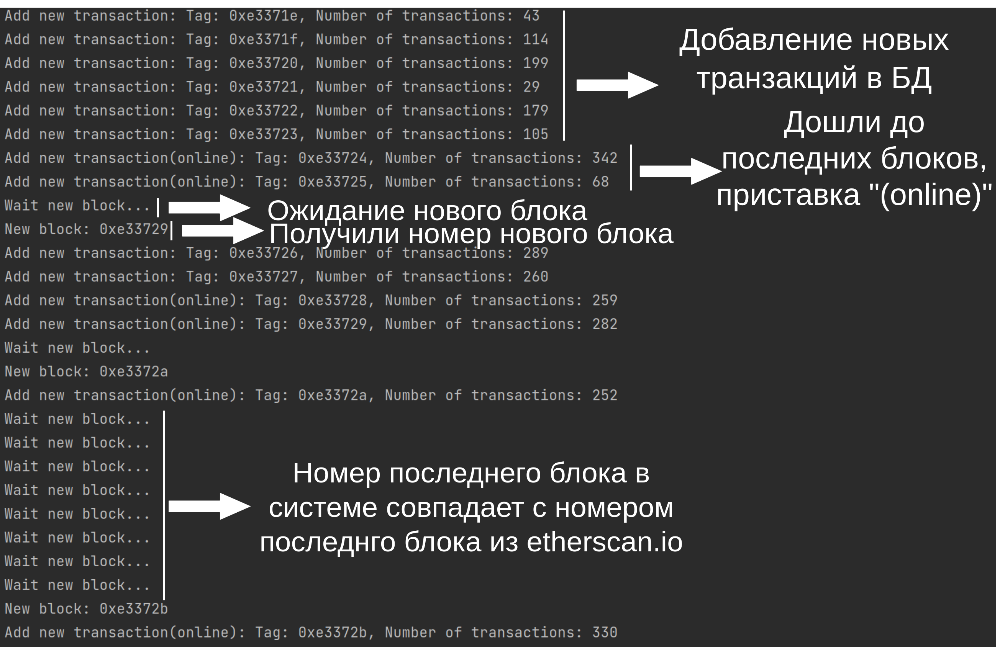
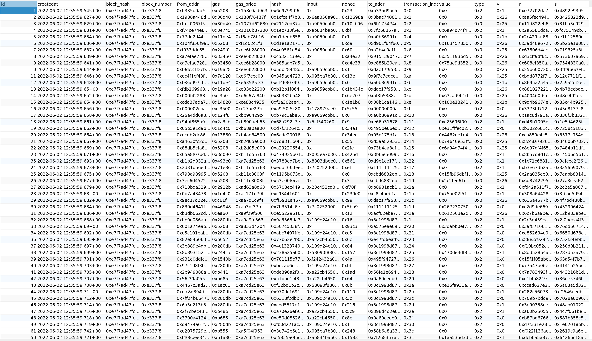
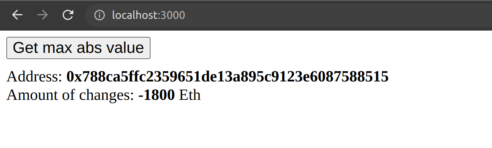

## Весь проект разделен на 2 части, по задачам
> ### Daemon: запись информации о транзакциях в БД

> ### Api: поиск самого большого изменения по абсолютному значению 

## Инструкция по запуску:
### Задача #1 Daemon:

> Так как выборка данных происходит довольно медленно, я начал не с адреса 9842805, а отступил от последнего блока 20 блоков и начал с него, сначала в базу запишутся транзакции из последних 20 блоков, а затем обновление будет в реальном времени, если нужно больше блоков - в файле config.ts можно поменять отступ в переменной "offsetFromLastBlock"

1. Развернуть СУБД PostgreSQL, я делал в докере, в директории dockerDB лежит скрипт:
    ```sh
   cd dockerDB
    sh ./createDb.sh
    ```
   Он развернет docker контейнер с базой и создаст в ней таблицу
2. Устанавливаем зависимости: 
   ```sh
   npm install
    ```
3. Запускаем:
   ```sh
   npm run startDaemon
    ```
### Пример того как должна выглядеть программа:

### База данных с транзакциями:


### Задача #2 Api:

1. Устанавливаем зависимости (если еще не установили):
   ```sh
   npm install
    ```
   
2. Запускаем сервер:
   ```sh
   npm run startApi
   ```

3. Переходим по адресу:
   ```sh
   localhost:3000
   ```
4. Нажимаем кнопку "Get max abs value" и ждем
> Выборка данных занимает много времени (http запросы), поэтому ожидание 100 блоков и расчет транзакций занимает около 50 сек., в файле config.ts в переменной "calcBlockCount" можно поменять количество выбираемых блоков
### Пример того как должна выглядеть программа:


## Логика работы
### Задача #1 Daemon:

> При старте инициализируется последний блок. В бесконечном цикле сравнивается текущий номер блока и последний, если текущий меньше чем последний то проихсодит выборка транзакций и запись в БД, если же номер текущего блока дошел до последнего то проихсходит обновление последнего блока

### Задача #2 Api:

> При отправке post запроса происходит выборка последних 100 блоков по порядку, из каждого извлекаются транзакции, и записываются в Map<string, number>, то есть Map хранит в себе адрес и сумму, изначально сумма инициализируется нулем. Каждая транзакция содержит адреса отправителя и получателя, это означает что отправленное значение в каждой транзакции уменьшается у отправителя и увеличивается у получателя:

`addresses[transaction[].from] = 0`

`addresses[transaction[].to] = 0`

`addresses[transaction[].from] -= transaction[].value`

`addresses[transaction[].to] += transaction[].value`
